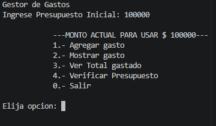
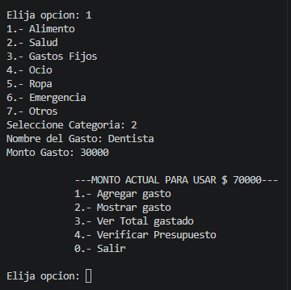
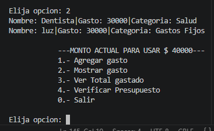
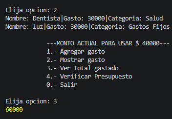

# GESTOR DE GASTOS

## ¿En que consiste el Proyecto?
- Es un simple gestor de gasto ejecutado en en consola.

## ¿ Como se instala ?
- Se descarga el proyecto de GitHub .Se puede ejecutar a travez de consola con Node.js o atravez de un editor de codigo con Node.js.

## ¿ Como se usa?
- A travez de consola se van ingresando datos.

## Funcionalidad
- El Menu cuenta con el Ingreso de presupuesto. Luego cuenta con un menu que agrega la lista de cada gasto, muestra, ver el total y verfificar contando con un 30% porciento.

## Estructura
- Las funciones principales son las siguientes
- Agrega el presupuesto 
- Menu principaL   
- agregar los gastos 
- mostrar los gastos  
- ver el total gastado
- ademas de validaciones de ingreso de datos.